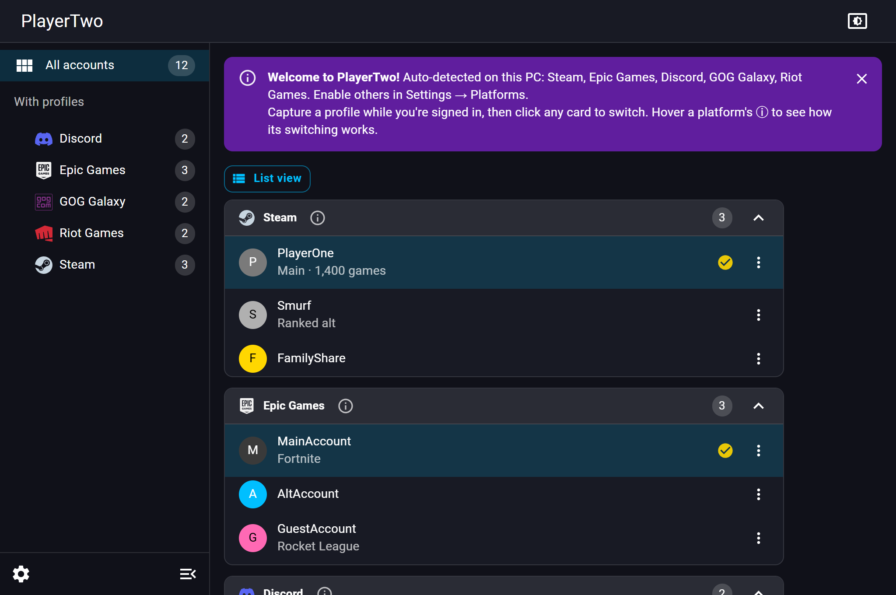
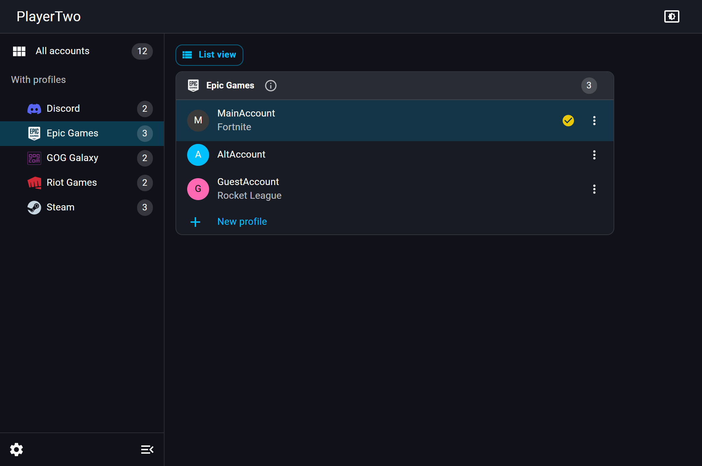
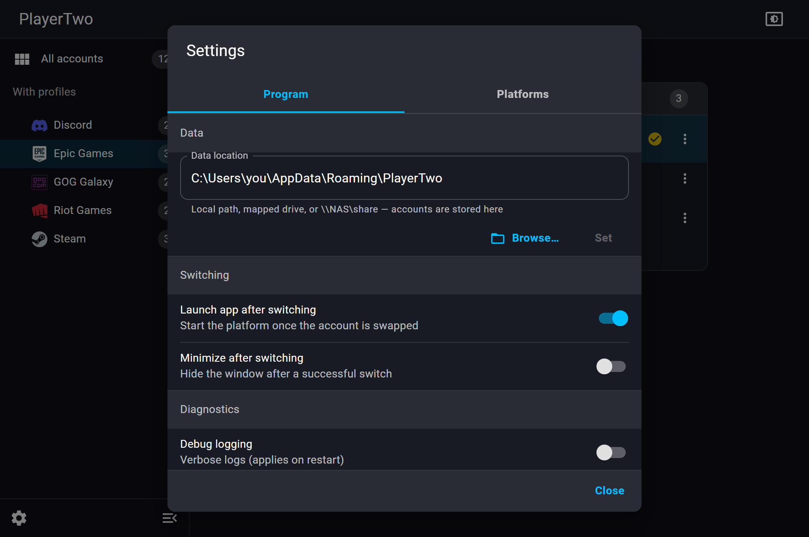
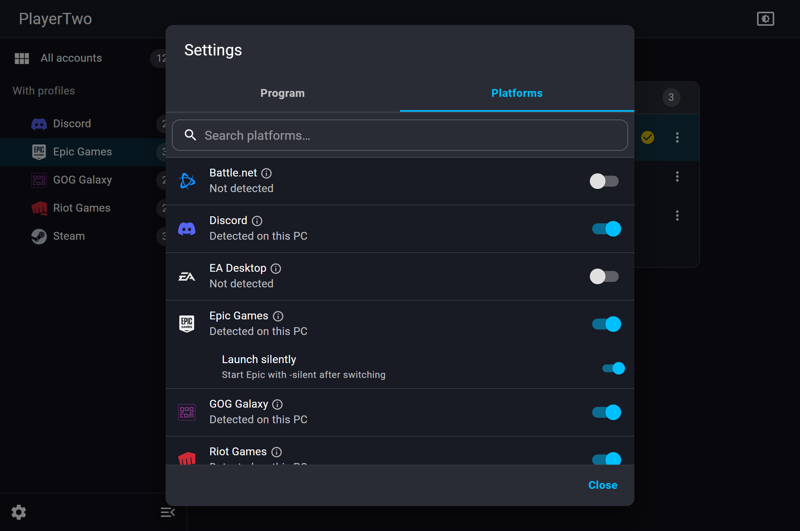

<div align="center">

# 🎮 PlayerTwo

**A fast account switcher for games and apps — switch logins without retyping passwords.**

Tauri (Rust) · React · Material UI · Windows

<br/>



</div>

---

## What it is

PlayerTwo lets you keep multiple accounts for a launcher or app (Steam, Epic, Discord, …)
and switch between them in a couple of clicks. It works the way account switchers do:
for each platform it **saves the files and/or registry values that make up a login**,
then swaps them in and out while the app is closed.

- **No passwords are stored.** It only moves the login tokens/files the platform itself
  already keeps on your machine.
- **Per-platform aware.** Steam and Epic have dedicated handling (Steam flips its own
  account list; Epic swaps just its login token); everything else uses a generic
  file/registry swap.
- **Store anywhere — even a NAS.** The saved-account store location is configurable
  (local path, mapped drive, or `\\NAS\share`).

> **Status:** active development, **Windows-first**. The architecture is built so
> Linux/macOS can be added later. Many platform definitions are best-effort and
> should be verified against a real install — see [Supported platforms](#supported-platforms).

## Features

- One-click switching with the active account highlighted
- **Import current login** (non-destructive) or **New profile** (log out → fresh sign-in)
- Per-account avatars, display names, and notes
- Auto-detection of installed platforms (+ manual enable for any platform)
- Card-grid or compact list views; collapsible per-platform groups
- Light / dark / system theme
- Built-in updater (GitHub Releases) and debug logging
- Configurable data location (USB / mapped drive / NAS)

## Screenshots

| Single platform | Settings · Program | Settings · Platforms |
|---|---|---|
|  |  |  |

> Screens show sample profiles for illustration — PlayerTwo never ships with accounts.

## Supported platforms

**Dedicated handling:** Steam · Epic Games

**Generic file/registry swap:** GOG Galaxy · Discord (+ Canary / PTB) · EA Desktop ·
Origin · Ubisoft Connect · Battle.net · Rockstar · Riot Games · Jagex · GeForce NOW ·
Oculus · OBS Studio · PS Remote Play · Genshin Impact · Honkai: Star Rail · Magic Arena ·
Albion Online · Arena Breakout: Infinite · Delta Force: Hawk Ops

> Definitions live in `src-tauri/src/defs/builtin.json`. They're ported/adapted from the
> GPL-3.0 [TcNo Account Switcher](https://github.com/TCNOco/TcNo-Acc-Switcher) plus first-hand
> research, and are **best-effort** — verify a platform on your machine before trusting it.

## How switching works

| Platform | Mechanism |
|---|---|
| **Steam** | Reads accounts from Steam's own `loginusers.vdf`; switching flips the `MostRecent`/`AutoLoginUser` flags. Needs "remember password" set once per account. |
| **Epic** | Saves the `[RememberMe]` token per account and writes it back on switch (no logout needed). |
| **Everything else** | Captures the platform's login files/registry into the store, then swaps the chosen profile in (closing the app first). |

The generic switch (engine, `src-tauri/src/switcher/engine.rs`):
1. Kill the platform's processes (so files aren't locked) and wait for exit.
2. Detect the current account; if it's a saved one, refresh its snapshot.
3. Clear the live login.
4. Restore the target account's files + registry values.
5. Relaunch the platform.

## Install

**⬇ [Download PlayerTwo 0.1.0 — Windows installer (.exe)](https://github.com/totally-cool/PlayerTwo/releases/download/v0.1.0/PlayerTwo_0.1.0_x64-setup.exe)**

Or browse every build (`.msi` included) on the [**Releases**](https://github.com/totally-cool/PlayerTwo/releases/latest) page.
Windows may show a SmartScreen warning until the app is code-signed — click "More info → Run anyway".

## Build from source

**Prerequisites**
- [Rust](https://rustup.rs) (stable) — `winget install Rustlang.Rustup`
- MSVC C++ build tools — `winget install Microsoft.VisualStudio.2022.BuildTools` ("Desktop development with C++")
- WebView2 runtime (preinstalled on Windows 11)
- Node.js 20+
- See <https://tauri.app/start/prerequisites/>

```bash
git clone https://github.com/totally-cool/PlayerTwo.git
cd PlayerTwo
npm install
npm run tauri dev      # run the desktop app
npm run tauri build    # build an installer
```

Frontend-only checks (no Rust): `npm run build`.

## Usage

- **Add a profile:** open a platform, sign in, then **Import current login** to save it —
  or **New profile** to log out and sign into a different account first.
- **Switch:** click an account card/row (the app closes the launcher, swaps, and relaunches).
- **Manage:** the **⋮** on a card opens profile settings (name, note, avatar, delete).
- **Settings (⚙, bottom-left):** enable/disable platforms, set the data location,
  toggle auto-launch / minimize-after-switch, enable debug logging, check for updates.

## Data, logging & privacy

- **Saved accounts** live in `%APPDATA%\PlayerTwo\accounts\<platform>\` by default
  (changeable in Settings → Data; supports NAS/UNC paths).
- **No passwords** are read or stored — only the platform's own login tokens/files.
- **Logs** are written next to the executable as `playertwo.log` (verbose when
  *Debug logging* is on). Open/copy the path from Settings → Diagnostics.
- Platform **logos** belong to their respective owners and are used only to identify
  each platform.

## Architecture

```
src/                      React + MUI frontend (theme.ts, api.ts, App.tsx, …)
src-tauri/src/
  switcher/   OS-independent core: model, engine, store, settings, steam, epic
  os/         portability seam — trait `Host` (windows.rs today; stub for later)
  defs/       builtin.json — declarative platform definitions
  commands.rs Tauri command surface (the only thing the UI calls)
```

Every OS-specific action (registry, process control, path expansion) sits behind the
`Host` trait, so adding Linux/macOS means a new `Host` impl + per-OS defs — nothing in
`switcher/` changes. See [CONTRIBUTING.md](CONTRIBUTING.md) to add a platform.

## License & attribution

Licensed under **GPL-3.0-or-later** (see [`LICENSE`](LICENSE)).

Platform definitions are **ported from the GPL-3.0
[TcNo Account Switcher](https://github.com/TCNOco/TcNo-Acc-Switcher)** (© TroubleChute /
Wesley Pyburn); because that data is incorporated, PlayerTwo is a derivative work under
the same license. The Rust engine, the Steam/Epic modules, and the React/MUI UI are
original to this project.
